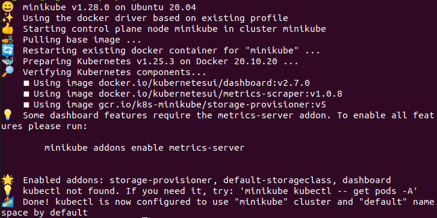
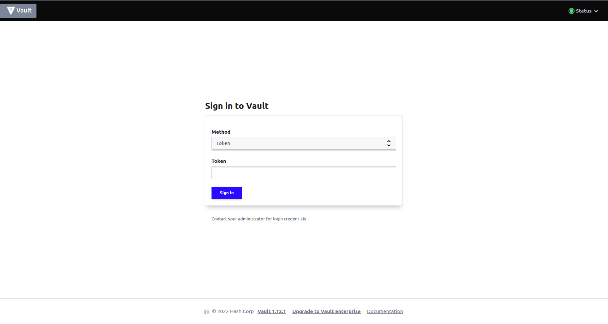
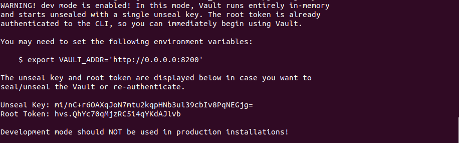
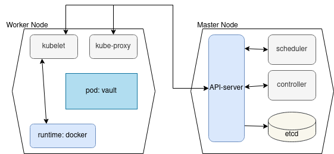
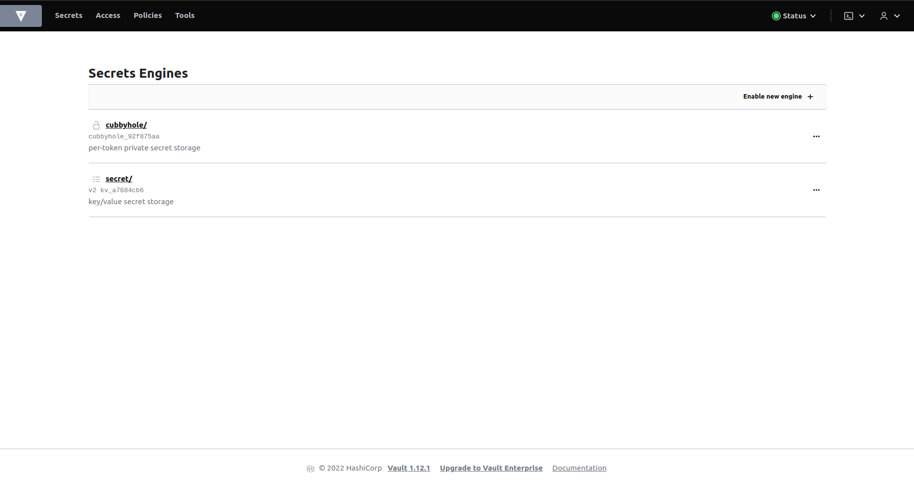

    University: [ITMO University](https://itmo.ru/ru/)
    Faculty: [FICT](https://fict.itmo.ru)
    Course: [Introduction to distributed technologies](https://github.com/itmo-ict-faculty/introduction-to-distributed-technologies)
    Year: 2022/2023
    Group: k4112c
    Author: Chernogor Ekaterina Alekseevna
    Lab: Lab1
    Date of create: 17.11.2022
    Date of finished: 


# Лабораторная работа №1 "Установка Docker и Minikube, мой первый манифест."

## Описание

Это первая лабораторная работа в которой вы сможете протестировать Docker, установить Minikube и развернуть свой первый "под".

## Цель работы

Ознакомиться с инструментами Minikube и Docker, развернуть свой первый "под".

## Ход работы

### Подготовительная работа
1. Установить [Docker](https://www.docker.com/) и проверить его работоспособность
2. Установить [Minikube](https://minikube.sigs.k8s.io/docs/start/) 
3. Создать alias для команды `minikube kubectl --`
```
$ alias kubectl="minikube kubectl --"
```
**Примечание**: 
Изначально работа планировалась выполняться на ОС Windows 10 Pro, с помощью приложения Docker Desktop. Однако после нескольких попыток починить ошибку бесконечной остановки контейнеров `docker container stopped`, было принято решение переключиться на Ubuntu 20.4LTS. После этого шага в рамках выполнения лабораторной более не возникало проблем или ошибок.


### Основная работа 
1. Для начала необходимо изучить что такое minikube, почему и как он связан с kubernetes. Ознакомиться со структурой и основами работы k8s. Для этого были использованы следующие материалы[1-10].
2. Далее был скачан образ контейнера: [vault](https://hub.docker.com/_/vault/). 
```
$ docker pull vault
```
> Vault - это инструмент для безопасного доступа к секретам. Секрет - это все, к чему вы хотите иметь строго контролируемый доступ, например, ключ API, пароли, сертификаты и многое другое. Хранилище предоставляет унифицированный интерфейс для любого секрета, обеспечивая при этом жесткий контроль доступа и запись подробного журнала аудита.
3. Далее развернут кластер 
```
$ minikube start
```

4. В кластере была применена конфигурация к ресурсу с помощью `yaml` файла, или другими словами был создан pod на основе конфигурации файла [`./lab1/manifest.yml`](manifest.yml)
```
$ kubectl apply -f ./lab1/manifest.yml
> service/vault created
```
5. Далее был создан сервис, который позволит получить доступ к поду из внешней среды. В кластере поды могут взаимодействовать друг с другом через localhost, однако, для доступа извне необходимо создать сервис и прокинуть порты.
```
$ kubectl expose pod vault --type=NodePort --port=8200
> service/vault exposed
```
6. В контейнер был прокинут порт 8200, и теперь есть доступ по 8200 порту. В контейнер vault можно зайти по ссылке http://localhost:8200
```
$ kubectl port-forward service/vault 8200:8200
> Forwarding from 127.0.0.1:8200 -> 8200
> Forwarding from [::1]:8200 -> 8200
> Handling connection for 8200
> Handling connection for 8200
> ...
```
7. В результате выполнения предыдущего шага открылась страница логина. 



Но для того чтобы зайти дальше страницы авторизации и посмотреть, что есть в личном кабинете необходимо найти токен входа. Поэтому были открыты логи, в которых был найден root token `hvs.QhYc70qMjzRC5i4qYKdAJlvb
`
```
$ kubectl logs vault
```


8. После успешного выполнения работы и входа в систему кластер был остановлен.
```
$ minikube stop
> ✋  Stopping node "minikube"  ...
> 🛑  Powering off "minikube" via SSH ...
> 🛑  1 node stopped.
```


## Результаты и выводы
В ходе выполнения данной работы получилось создать pod на основе написанной [конфигурации](manifest.yml), создать сервис для взаимодействия с подом и зайти внутрь контейнера. На рисунке ниже изображена конфигурация работы кластера

и контейнер в который был выполнен вход 


В результате были изучены основы создания и развертывания конфигураций.


# Ссылки на материалы
1. [Overview](https://kubernetes.io/docs/concepts/overview/)
2. [Pods](https://kubernetes.io/docs/concepts/workloads/pods/)
3. [Использование Minikube для создания кластера](https://kubernetes.io/ru/docs/tutorials/kubernetes-basics/create-cluster/cluster-intro/)
4. [Использование kubectl для развёртывания приложения](https://kubernetes.io/ru/docs/tutorials/kubernetes-basics/deploy-app/deploy-intro/)
5. [Изучение подов и узлов](https://kubernetes.io/ru/docs/tutorials/kubernetes-basics/explore/explore-intro/)
6. [Создание сервиса для открытия доступа к приложению](https://kubernetes.io/ru/docs/tutorials/kubernetes-basics/expose/expose-intro/)
7. [Запуск нескольких экземпляров приложения](https://kubernetes.io/ru/docs/tutorials/kubernetes-basics/scale/scale-intro/)
8. [Выполнение плавающего обновления](https://kubernetes.io/ru/docs/tutorials/kubernetes-basics/update/update-intro/)
9. [Exposing an External IP Address to Access an Application in a Cluster](https://kubernetes.io/docs/tutorials/stateless-application/expose-external-ip-address/)
10. [Connecting Applications with Services](https://kubernetes.io/docs/tutorials/services/connect-applications-service/)
