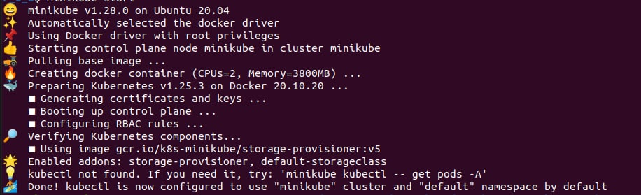
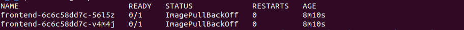
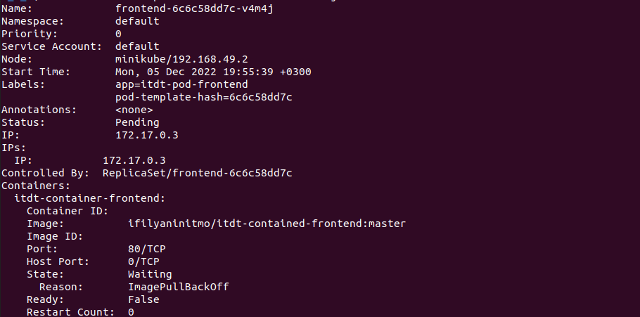
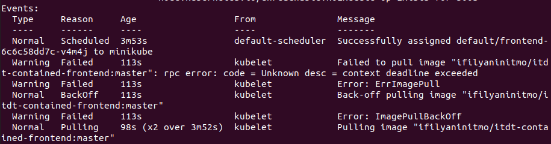
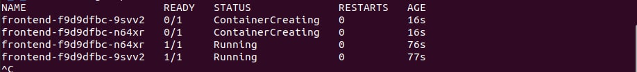
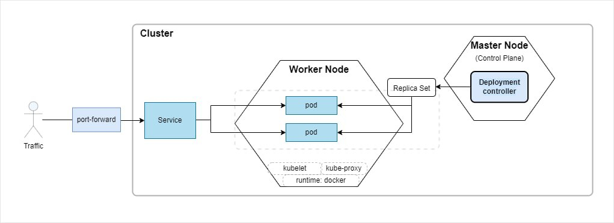
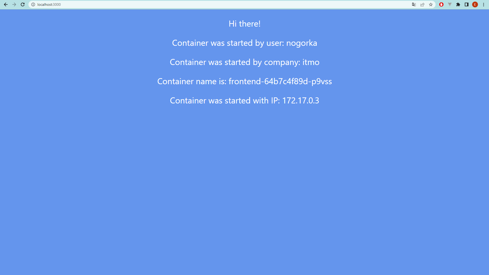

    University: [ITMO University](https://itmo.ru/ru/)
    Faculty: [FICT](https://fict.itmo.ru)
    Course: [Introduction to distributed technologies](https://github.com/itmo-ict-faculty/introduction-to-distributed-technologies)
    Year: 2022/2023
    Group: k4112c
    Author: Chernogor Ekaterina Alekseevna
    Lab: Lab2
    Date of create: 17.11.2022
    Date of finished: 10.12.2022


# Лабораторная работа №2 "Развертывание веб сервиса в Minikube, доступ к веб интерфейсу сервиса. Мониторинг сервиса."

## Описание

В данной лабораторной работе вы познакомитесь с развертыванием полноценного веб сервиса с несколькими репликами.

## Цель работы

Ознакомиться с типами "контроллеров" развертывания контейнеров, ознакомится с сетевыми сервисами и развернуть свое веб приложение.

## Ход работы

### Подготовительная работа
1. Для начала необходимо скачать образ необходимого контейнера.
```
docker pull ifilyaninitmo/itdt-contained-frontend:master
```

### Основная работа 
1. Любая работа начинается с развертывания кластера
```
$ minikube start
```



2. Далее создаем `yaml` манифест для развертывания `deployment` в декларативном порядке. Необходимо создать deployment с 2 репликами контейнера `ifilyaninitmo/itdt-contained-frontend:master` и передать переменные в эти реплики: `REACT_APP_USERNAME`, `REACT_APP_COMPANY_NAME`. Ознакомиться с конфигурацией можно в [источнике](deployment.yml)


3. Следующим шагом применяем созданную конфигурацию

```
$ kubectl apply -f ./lab2/deployment.yml
> deployment.apps/frontend created
```
4. Обязательно проверяем, что все работает и `deployment` успешно развернулась
```
$ kubectl get pods
```



5. В процессе выполнения видим, что `pod`ы не стартуют. Для выяснения ситуации и дальнейшего устранения ошибок и запускаем команду `describe`
```
$ kubectl describe <pod_name>
```




6. Из логов видно, что контейнер не успевает развернуться из-за ограничения по ресурсам. Поэтому скачиваем образ контейнера напрямую в minikube кластер через ssh подключение
```
$ minikube ssh docker pull ifilyaninitmo/itdt-contained-frontend:master
```

7. Теперь заново пробуем создать `deployment` и сразу проверяем, что все `pod`ы работают без ошибок
```
$ kubectl apply -f ./lab2/deployment.yml
$ kubectl get pods -w
```



8. Далее необходимо создать `service`, для настройки внешнего доступа и взаимодействия с `pod`ами. В декларативном порядке создаем `service` типа `NodePort`. Конфигурацию можно посмотреть в [источнике](service.yml)
```
$ kubectl apply -f ./lab2/service.yml
> service/frontend exposed
```
> Kubernetes предоставляет возможность создавать следующие типы сервисов: ClusterIP, NodePort, LoadBalancer, ExternalName, (см. примечание ниже).

9. Остается только прокинуть порты, и можно смотреть на результат работы контейнера на `localhost:3000`
```
$ kubectl port-forward service/frontend 3000:3000
> Forwarding from 127.0.0.1:3000 -> 3000
> Forwarding from [::1]:3000 -> 3000
> Handling connection for 3000
> ...
```


## Результаты и выводы
В ходе выполнения данной работы получилось создать `deployment` с двумя репликами контейнера на основе написанной [конфигурации](deployment.yml), создать [сервис](service.yml) для взаимодействия и зайти внутрь контейнера. На рисунке ниже изображена конфигурация работы кластера



и контейнер в который был выполнен вход 




### Примечание
__Типы сервисов:__
1. __ClusterIP__ - это стандартный и наиболее распространенный тип сервиса. Kubernetes назначит службе ClusterIP внутренний IP-адрес кластера. Это делает службу доступной только внутри кластера. Запросы не могут отправляться извне кластера. Можно дополнительно задать IP-адрес кластера в манифесте.

> __Варианты использования:__ 
межсервисная коммуникация внутри кластера. Например, связь между интерфейсным и серверным компонентами приложения.

2. __NodePort__ является расширением ClusterIP. Сначала автоматически создается ClusterIP, к которой дополнительно добавляется NodePort. Он предоставляет сервис за пределами кластера, добавляя порт для всего кластера поверх ClusterIP. NodePort предоставляет на каждый IP ноды статичный порт. Каждая нода проксирует этот порт в сервис. Таким образом, внешний трафик имеет доступ к фиксированному порту на каждой ноде. Это означает, что любой запрос к кластеру на этом порту перенаправляется в сервис. Связаться с сервисом NodePort из-за пределов кластера можно запросив `<NodeIP>:<NodePort>`. Порт ноды должен находиться в диапазоне 30000-32767. Вручную выделять порт для службы необязательно. Если он не определен, Kubernetes автоматически назначит его.

> __Варианты использования:__
Необходимость подключить внешнее соединение к сервису. Настроить собственное решение для балансировки нагрузки, настроить среды, которые не полностью поддерживаются Kubernetes, или даже напрямую предоставлять IP-адреса одного или нескольких узлов.

3. __LoadBalancer__ - является расширением NodePort. NodePort и ClusterIP, к которым направляется внешний балансировщик нагрузки, создаются автоматически. LoadBalancer интегрирует NodePort с облачными балансировщиками нагрузки. Он предоставляет услугу извне, используя балансировщик нагрузки облачного провайдера. Каждый раз, для предоставления внешнему миру доступа к сервису, необходимо создать новый балансировщик нагрузки и получать IP-адрес.

> __Варианты использования:__ 
когда используется облачный провайдер для хостинга kubernetes кластера.

4. __ExternalName__ сопоставляют службу с DNS-именем (обычно сопоставление происходит по селекторам).

> __Варианты использования:__ 
используется для создания сервиса представления внешнего хранилища данных, как например база данных, которая работает вне kubernetes. Также можно использовать ExternalName, как локальный сервис, когда поды из одного неймспейса общаются с сервисом в другом неймспейсе


---
## Ссылки на материалы
- [Deployments](https://kubernetes.io/docs/concepts/workloads/controllers/deployment/)
- [Define Environment Variables for a Container](https://kubernetes.io/docs/tasks/inject-data-application/define-environment-variable-container/)
- [Expose Pod Information to Containers Through Environment Variables](https://kubernetes.io/docs/tasks/inject-data-application/environment-variable-expose-pod-information/)
- [Service](https://kubernetes.io/docs/concepts/services-networking/service/)
- [Kubernetes — Service Types Overview](https://medium.com/devops-mojo/kubernetes-service-types-overview-introduction-to-k8s-service-types-what-are-types-of-kubernetes-services-ea6db72c3f8c)
