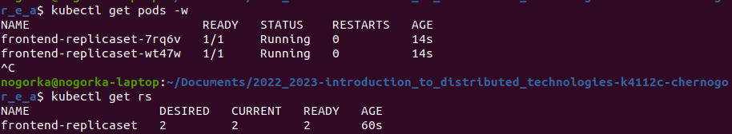
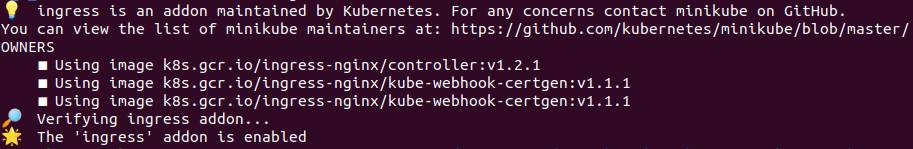

    University: [ITMO University](https://itmo.ru/ru/)
    Faculty: [FICT](https://fict.itmo.ru)
    Course: [Introduction to distributed technologies](https://github.com/itmo-ict-faculty/introduction-to-distributed-technologies)
    Year: 2022/2023
    Group: k4112c
    Author: Chernogor Ekaterina Alekseevna
    Lab: Lab2
    Date of create: 07.12.2022
    Date of finished: 


# Лабораторная работа №3 "Сертификаты и "секреты" в Minikube, безопасное хранение данных."

## Описание

В данной лабораторной работе вы познакомитесь с сертификатами и "секретами" в Minikube, правилами безопасного хранения данных в Minikube.

## Цель работы

Познакомиться с сертификатами и "секретами" в Minikube, правилами безопасного хранения данных в Minikube.
---
## Ход работы
- [X] Вам необходимо создать configMap с переменными: REACT_APP_USERNAME, REACT_APP_COMPANY_NAME.

- [X] Вам необходимо создать replicaSet с 2 репликами контейнера ifilyaninitmo/itdt-contained-frontend:master и используя ранее созданный configMap передать переменные REACT_APP_USERNAME, REACT_APP_COMPANY_NAME .

- [ ] Включить minikube addons enable ingress и сгенерировать TLS сертификат, импортировать сертификат в minikube.

- [ ] Создать ingress в minikube, где указан ранее импортированный сертификат, FQDN по которому вы будете заходить и имя сервиса который вы создали ранее.

> Если вы делаете эту работу на Windows/macOS для доступа к ingress вам необходимо использовать команду minikube tunnel к созданному ingress. Если вы делаете эту работу на Windows/macOS для доступа к ingress вам необходимо в hosts добавить ip address и ваш FQDN.

- [ ] В hosts пропишите FQDN и IP адрес вашего ingress и попробуйте перейти в браузере по FQDN имени.

- [ ] Войдите в веб приложение по вашему FQDN используя HTTPS и проверьте наличие сертификата.

> Обычно в браузере это маленький замочек рядом с FQDN сайта, нажмите на него и сделайте скриншот с информацией.

### Подготовительная работа
1. Запускаем кластер и заливаем в него образ контейнера
```
$ minikube start
$ minikube ssh docker pull ifilyaninitmo/itdt-contained-frontend:master
```
2. Скачиваем утилиту `mkcert` для генерации TLS сертификата
```
$ sudo apt install libnss3-tools

$ curl -JLO "https://dl.filippo.io/mkcert/latest?for=linux/amd64"
$ chmod +x mkcert-v*-linux-amd64

$ sudo cp mkcert-v*-linux-amd64 /usr/local/bin/mkcert
```

### Основная работа 
1. Вам необходимо создать [configMap](configmap.yml) с переменными: `REACT_APP_USERNAME`, `REACT_APP_COMPANY_NAME`.

    ```
    $ kubectl apply -f lab3/configmap.yml
    > configmap/frontend-configmap created
    ```

2. Вам необходимо создать [replicaSet](replicaset.yml) с 2 репликами контейнера `ifilyaninitmo/itdt-contained-frontend:master` и используя ранее созданный configMap передать переменные `REACT_APP_USERNAME`, `REACT_APP_COMPANY_NAME`.
    - создаем [манифест](replicaset.yml)
    - применяем манифест 
        ```
        $ kubectl apply -f lab3/replicaset.yml
        > replicaset/frontend-replicaset created
        ```
    - проверяем работоспособность
        ```
        $ kubectl get pods -w
        $ kubectl get rs
        ```
        

3. Включить `minikube addons enable ingress` и сгенерировать TLS сертификат, импортировать сертификат в minikube.
    - генерируем сертификат
        ```
        $ mkcert -install
        $ mkcert nogorka.com "*.nogorka.com" nogorka.test localhost 127.0.0.1 ::1
        ```
    - создаем из сертификата секрет c именем `mkcert` в нейспейсе `kube-system`
        ```
        $ kubectl -n kube-system create secret tls mkcert --key lab3\nogorka.com+5-key.pem --cert lab3\nogorka.com+5.pem
        > secret/mkcert created
        ```
    - проверяем наличие сертификата
        ```
        $ kubectl get secrets -n kube-system
        $ kubectl describe secret mkcert -n kube-system
        ```
        
    - включаем addon ingress
        ```
        $ minikube addons enable ingress
        ```
        

4. Создать ingress в minikube, где указан ранее импортированный сертификат, FQDN по которому вы будете заходить и имя сервиса который вы создали ранее.
    - создаем [сервис](service.yaml) типа `NodeType`
    ```
    $ kubectl apply -f lab3/service.yml
    > service/frontend-service created
    ```
    - создаем [ingress](ingress.yml)
    ```
    $ kubectl apply -f lab3/ingress.yml
    > ingress/frontend-ingress created
    ```
5. В hosts пропишите FQDN и IP адрес вашего ingress и попробуйте перейти в браузере по FQDN имени.    
    - откроем на `hosts` и добавим адрес `ingress`
    ```
    $ sudo nano /etc/hosts
    ```
    - добавляем строчку `<ingress adress> nogorka.com` в конец файла

6. Войдите в веб приложение по вашему FQDN используя HTTPS и проверьте наличие сертификата.


## Результаты и выводы


### Примечание

- сложно было разобраться

---
## Ссылки на материалы
1. [ConfigMaps](https://kubernetes.io/docs/concepts/configuration/configmap/)
2. [ReplicaSet](https://kubernetes.io/docs/concepts/workloads/controllers/replicaset/)
3. [How to use custom TLS certificate with ingress addon](https://minikube.sigs.k8s.io/docs/tutorials/custom_cert_ingress/)
4. [mkcert](https://github.com/FiloSottile/mkcert)
5. [Ingress DNS](https://minikube.sigs.k8s.io/docs/handbook/addons/ingress-dns/)
6. [Ingress](https://kubernetes.io/docs/concepts/services-networking/ingress/)