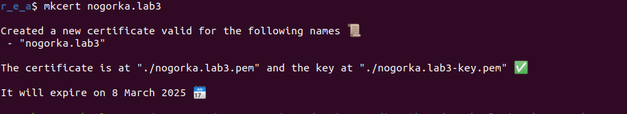
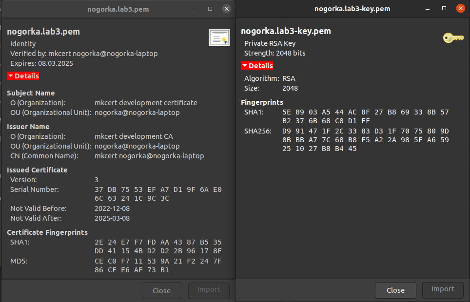
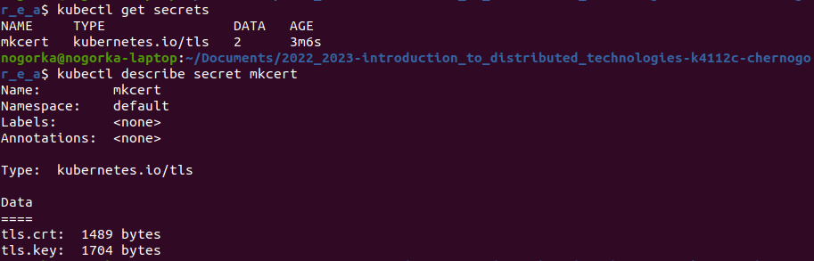
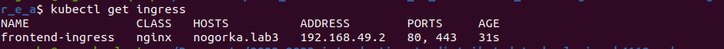
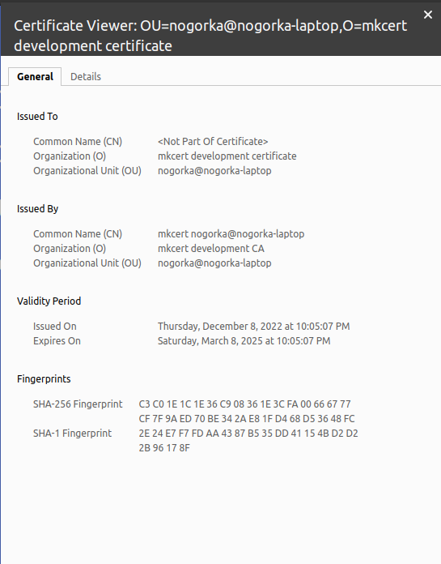
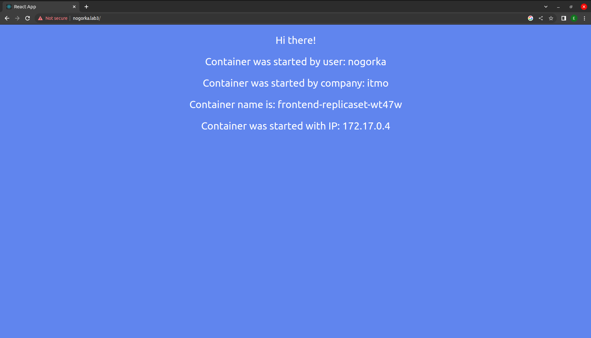
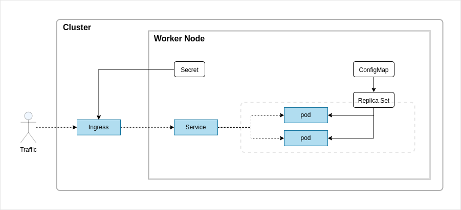

    University: [ITMO University](https://itmo.ru/ru/)
    Faculty: [FICT](https://fict.itmo.ru)
    Course: [Introduction to distributed technologies](https://github.com/itmo-ict-faculty/introduction-to-distributed-technologies)
    Year: 2022/2023
    Group: k4112c
    Author: Chernogor Ekaterina Alekseevna
    Lab: Lab3
    Date of create: 07.12.2022
    Date of finished: 


# Лабораторная работа №3 "Сертификаты и "секреты" в Minikube, безопасное хранение данных."

## Описание

В данной лабораторной работе вы познакомитесь с сертификатами и "секретами" в Minikube, правилами безопасного хранения данных в Minikube.

## Цель работы

Познакомиться с сертификатами и "секретами" в Minikube, правилами безопасного хранения данных в Minikube.

## Ход работы

### Подготовительная работа
1. Запускаем кластер и заливаем в него образ контейнера
```
$ minikube start
$ minikube ssh docker pull ifilyaninitmo/itdt-contained-frontend:master
```
2. Скачиваем утилиту `mkcert` для генерации TLS сертификата
```
$ sudo apt install libnss3-tools

$ curl -JLO "https://dl.filippo.io/mkcert/latest?for=linux/amd64"
$ chmod +x mkcert-v*-linux-amd64

$ sudo cp mkcert-v*-linux-amd64 /usr/local/bin/mkcert
```

### Основная работа 
1. Вам необходимо создать [configMap](configmap.yml) с переменными: `REACT_APP_USERNAME`, `REACT_APP_COMPANY_NAME`.
    - создаем [манифест](configmap.yml)
    - применяем манифест 

    ```
    $ kubectl apply -f lab3/configmap.yml
    > configmap/frontend-configmap created
    ```

2. Вам необходимо создать [replicaSet](replicaset.yml) с 2 репликами контейнера `ifilyaninitmo/itdt-contained-frontend:master` и используя ранее созданный configMap передать переменные `REACT_APP_USERNAME`, `REACT_APP_COMPANY_NAME`.
    - создаем [манифест](replicaset.yml)
    - применяем манифест 
        ```
        $ kubectl apply -f lab3/replicaset.yml
        > replicaset/frontend-replicaset created
        ```
    - проверяем работоспособность
        ```
        $ kubectl get pods -w
        $ kubectl get rs
        ```
        

3. Включить `minikube addons enable ingress` и сгенерировать TLS сертификат, импортировать сертификат в minikube.
    - генерируем сертификат
        ```
        $ mkcert -install
        $ mkcert nogorka.lab3
        ```
        

        В результате в корне репозитория сгенерились два файла:
        

    - создаем из сертификата секрет c именем `mkcert`
        ```
        $ kubectl create secret tls mkcert --key nogorka.lab3-key.pem --cert nogorka.lab3.pem
        > secret/mkcert created
        ```
    - проверяем наличие секрета с сертификатом
        ```
        $ kubectl get secrets
        $ kubectl describe secret mkcert
        ```
        
    - включаем addon ingress
        ```
        $ minikube addons enable ingress
        ```
        

4. Создать ingress в minikube, где указан ранее импортированный сертификат, FQDN по которому вы будете заходить и имя сервиса который вы создали ранее.
    - создаем [service](service.yaml) типа `NodeType`
        ```
        $ kubectl apply -f lab3/service.yml
        > service/frontend-service created
        ```
    - создаем [ingress](ingress.yml)
        ```
        $ kubectl apply -f lab3/ingress.yml
        > ingress.networking.k8s.io/frontend-ingress created
        ```
    - проверяем работоспособность
        ```
        $ kubectl get ingress
        ```
        

5. В hosts пропишите FQDN и IP адрес вашего ingress и попробуйте перейти в браузере по FQDN имени.    
    - откроем файл `hosts` и добавим адрес `ingress` из предыдущей команды
        ```
        $ sudo nano /etc/hosts
        ```
    - добавляем строчку `192.168.49.2 nogorka.lab3` в конец ipv4 списка

6. Войдите в веб приложение по вашему FQDN используя HTTPS и проверьте наличие сертификата.

 

## Результаты и выводы
В ходе выполнения данной работы были изучены ресурсы `secret` и `configmap`, их отличия и способы использования. Был сгенерирован TSL сертификат с помощью утилиты `mkcert`, создан `ingress` ресурс и настроено их взаимодействие. 

На рисунке ниже изображена конфигурация работы кластера



### Примечание

В ходе выполнения была допущена ошибка, которая приводила к тому, что был не верный тип сертификата `Kubernetes Ingress Controller Fake Certificate`. Её удалось починить пересоздав сертификат и сконфигурировав ingress так, чтобы они находились в одном неймспейсе. В данном случае вся работа выполнялась в `namespace default`.

---
## Ссылки на материалы
1. [ConfigMaps](https://kubernetes.io/docs/concepts/configuration/configmap/)
2. [ReplicaSet](https://kubernetes.io/docs/concepts/workloads/controllers/replicaset/)
3. [How to use custom TLS certificate with ingress addon](https://minikube.sigs.k8s.io/docs/tutorials/custom_cert_ingress/)
4. [mkcert](https://github.com/FiloSottile/mkcert)
5. [Ingress DNS](https://minikube.sigs.k8s.io/docs/handbook/addons/ingress-dns/)
6. [Ingress](https://kubernetes.io/docs/concepts/services-networking/ingress/)