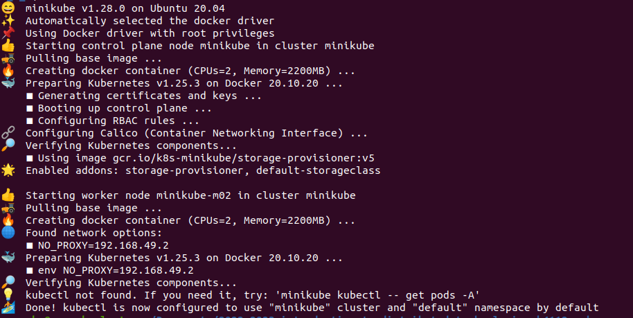
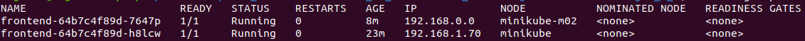
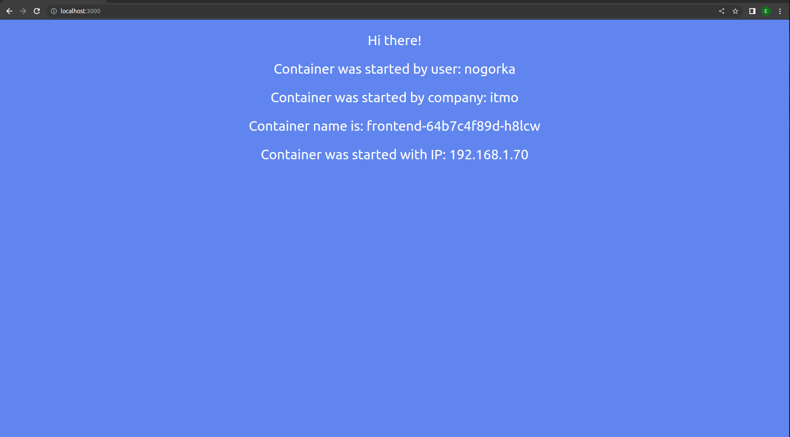
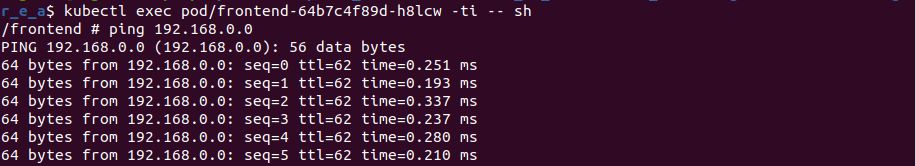
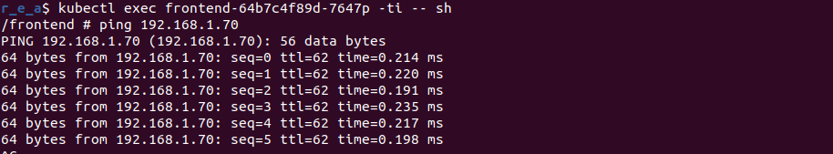
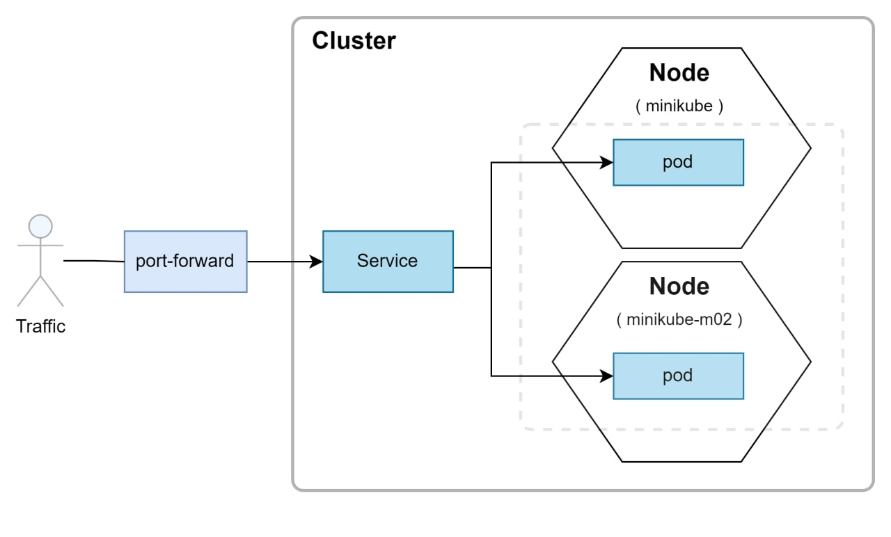

    University: [ITMO University](https://itmo.ru/ru/)
    Faculty: [FICT](https://fict.itmo.ru)
    Course: [Introduction to distributed technologies](https://github.com/itmo-ict-faculty/introduction-to-distributed-technologies)
    Year: 2022/2023
    Group: k4112c
    Author: Chernogor Ekaterina Alekseevna
    Lab: Lab4
    Date of create: 09.12.2022
    Date of finished: 22.12.2022


# Лабораторная работа №4 "Сети связи в Minikube, CNI и CoreDNS"

## Описание

Это последняя лабораторная работа в которой вы познакомитесь с сетями связи в Minikube. Особенность Kubernetes заключается в том, что у него одновременно работают underlay и overlay сети, а управление может быть организованно различными CNI.

## Цель работы

Познакомиться с CNI Calico и функцией IPAM Plugin, изучить особенности работы CNI и CoreDNS.

## Ход работы

### Подготовительная работа
1. Заливаем в кластер образы контейнеров
```
$ minikube ssh docker pull ifilyaninitmo/itdt-contained-frontend:master
$ minikube ssh docker pull docker.io/calico/cni
$ minikube ssh docker pull docker.io/calico/node
$ minikube ssh docker pull docker.io/calico/pod2daemon-flexvol
```

### Основная работа
1. При запуске minikube установите плагин CNI=calico и режим работы Multi-Node Clusters одновременно, в рамках данной лабораторной работы вам нужно развернуть 2 ноды.

- запускаем minikube
    ```
    $ minikube start --nodes 2 --cni calico
    ```
    

2. Проверьте работу CNI плагина Calico и количество нод, результаты проверки приложите в отчет.
- проверяем calico
    ```
    $ kubectl get pods -l k8s-app=calico-node -A
    ```
    

- проверяем ноды
    ```
    $ kubectl get nodes
    ```
    

3. Для проверки работы Calico мы попробуем одну из функций под названием IPAM Plugin. Для проверки режима IPAM необходимо для запущенных ранее нод указать label по признаку стойки или географического расположения (на ваш выбор).
    ```
    $ kubectl label nodes minikube area=irk
    > node/minikube labeled

    $ kubectl label nodes minikube-m02 area=spb
    > node/minikube-m02 labeled
    ```

4. После этого вам необходимо разработать манифест для Calico который бы на основе ранее указанных меток назначал бы IP адреса "подам" исходя из пулов IP адресов которые вы указали в манифесте. (значительно переписать)

- скачиваем [манифест](calicoctl.yml) с [официального источника](https://raw.githubusercontent.com/projectcalico/calico/v3.24.5/manifests/calicoctl.yaml) и применяем
    ```
    $ kubectl apply -f lab4/calicoctl.yml
    > serviceaccount/calicoctl created
    > pod/calicoctl created
    > clusterrole.rbac.authorization.k8s.io/calicoctl created
    > clusterrolebinding.rbac.authorization.k8s.io/calicoctl created
    ```

- поскольку ресурс `default-ipv4-ip` уже существует и учитывает весь блок /16, сначала удаляем его
    ```
    $ kubectl delete ippools default-ipv4-ippool
    > ippool.crd.projectcalico.org "default-ipv4-ippool" deleted
    ```
- создаем новые [ippool](ippool.yml) ресурсы для каждой node
    ```
    $ kubectl exec -i -n kube-system calicoctl -- /calicoctl apply -f - < lab4/ippool.yml
    > Successfully applied 2 'IPPool' resource(s)
    ```
- проверяем наличие ippool ресурсов
    ```
    $ kubectl exec -i -n kube-system calicoctl -- /calicoctl get ippool
    ```
    

5. Вам необходимо создать deployment с 2 репликами контейнера ifilyaninitmo/itdt-contained-frontend:master и передать переменные в эти реплики: REACT_APP_USERNAME, REACT_APP_COMPANY_NAME.
- воспользуемся [deployment](deployment.yml) из второй лабораторной
    ```
    $ kubectl apply -f lab4/deployment.yml
    > deployment.apps/frontend created
    ```

6. Создать сервис через который у вас будет доступ на эти "поды". Выбор типа сервиса остается на ваше усмотрение.
- воспользуемся [service](service.yml) из третьей лабораторной
    ```
    $ kubectl apply -f lab4/service.yml
    > service/frontend-service created
    ```

7. Запустить в minikube режим проброса портов и подключитесь к вашим контейнерам через веб браузер.
    ```
    $ kubectl port-forward service/frontend-service 3000:3000
    > Forwarding from 127.0.0.1:3000 -> 3000
    > Forwarding from [::1]:3000 -> 3000
    > ...
    ```
    
8. Используя kubectl exec зайдите в любой "под" и попробуйте попинговать "поды" используя FQDN имя соседнего "пода", результаты пингов необходимо приложить к отчету.
    - пингуем от контейнера `frontend-64b7c4f89d-h8lcw` с ippool `zone-irk-ippool` к контейнеру с ippool `zone-spb-ippool`
    
    - пингуем от контейнера `frontend-64b7c4f89d-7647p` с ippool `zone-spb-ippool` к контейнеру с ippool `zone-irk-ippool`
    


## Результаты и выводы
В ходе выполнения данной работы проведено ознакомление с CNI Calico и функцией IPAM Plugin, изучены особенности работы CNI и CoreDNS. Созданы и настроены два ippool ресурса для deployment с двумя pod'ами.

На рисунке ниже изображена конфигурация работы кластера



### Примечание
1. При проверке ippool возникало сообщение `ensure CRDs are installed first`. Одной из причин такого поведения была устаревшая версия apiVersion, т.е. вместо `apiVersion: projectcalico.org/v3` использовалась `apiVersion: projectcalico.org/v1`. Однако, исправление этого момента проблему решило лишь отчасти, поэтому для взаимодействия с calico также был импортирован calicoctl.

---
## Ссылки на материалы
1. [Calico для сети в Kubernetes: знакомство и немного из опыта](https://habr.com/ru/company/flant/blog/485716/)
2. [Install calicoctl](https://projectcalico.docs.tigera.io/maintenance/clis/calicoctl/install)
3. [Custom Resource Definitions](https://helm.sh/docs/chart_best_practices/custom_resource_definitions/)
4. [Extend the Kubernetes API with CustomResourceDefinitions](https://kubernetes.io/docs/tasks/extend-kubernetes/custom-resources/custom-resource-definitions/)
